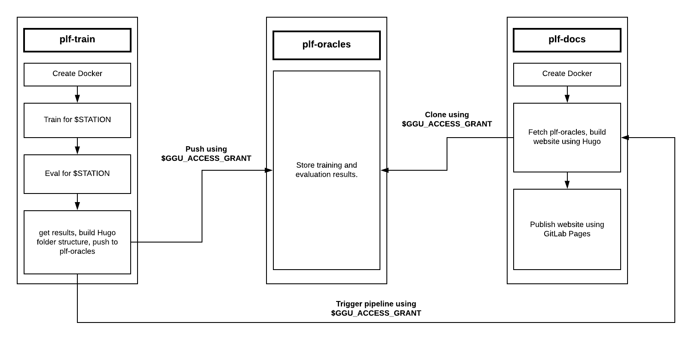

# Load forecasting on GitLab CI/CD

This Repository utilizes GitLab's CI/CD to train and evaluate RNN-Models in the cloud. Training has to be initiated manually by a user via [api](https://docs.gitlab.com/ee/api/pipelines.html#create-a-new-pipeline) or [web call](https://git.rwth-aachen.de/acs/public/automation/plf/plf-training/-/pipelines/new).

Additionally, after every commit (except the commit message contains "[skip ci]"), a linting and testing pipeline is created automatically to make sure
the project still works as intended and follows previously defined code conventions.

The CI uses multiple bash and python scripts each designed for one specific purpose. Those scripts can be found in the `shell/` folder.


## Structure

The CI implementation of this Repository features two different types of pipelines, one with three and one with four stages.

##### Training Pipeline (Four stages, one job each)



###### Job descriptions
The first stage uses a shell environment to set up a Docker Image the next jobs can be executed on. This Image has all necessary dependancies including the plf-util Python Package already installed and is only built, if its configuration (Dockerfile) or the dependancies change or there is no saved Image (e.g. first run).

The second stage uses the Docker Image created in the first stage and runs the fc_train.py script. The model file is saved as a GitLab Artifact under ./oracles. There are three ways to tell this stage, which station's data to perform the training on (see Usage)

The third stage uses the second stage's job's artifact and runs an evaluation on it. The output is in turn stored as an artifact in ./oracles. Its behaviour is adaptive to the second stage, making sure the evaluation happens for the station the model was trained for.

The fourth stage features the `push_to_oracles` job. Its job is to fetch the model and evaluation files generated by previous jobs, structure them
in an intuitive folder structure and push to the `plf-oracles` Repository. Afterwards, this job triggers the pipeline of `plf-docs`, which in turn fetches `plf-oracles` with all its newly added results and includes them in the website under the `Results` tab. Each result page has a link back to its source pipeline and `push_to_oracles` also safes the link to the corresponding result page as an Artifact.

###### Used scripts
The training pipeline utilizes multiple scripts found in the `shell/` folder. Those scripts and their uses are explained here:

|Script Name|Function|
|---|---|
|trigger_training.sh|Checks if the $STATION variable is defined and executes fc_train.py if so|
|execute_evaluation.sh|Executes fc_evaluate.py and gives $STATION as argument, if $STATION is not defined, extracts argument from within [ ] - Brackets in commit message (legacy feature, removed)|
|return_timestamp.py|Prints current timestamp in format yyyy-mm-dd_hh-mm-ss to command line|
|create_hugo_header.py|Creates the front matter for Hugo's `_index.md` files to generate structure used in docs/results web page|
|make_station_folder_index.sh|Creates `_index.md` in subdir the run is saved in to generate structure for Hugo result page|
|make_station_folder_index.py|Splits $STATION into subfolders at "/" characters and executes make_station_folder_index.sh for each|
|trigger_docs_pipeline|Triggers the `plf-docs` pipeline to fetch `plf-oracles` and build the website, uses private access token to authenticate.|

The private access token used to push to `plf-oracles` and trigger `plf-docs`'s pipeline is added as environment variable to the CI with name `$GGU_ACCESS_GRANT` and not included in the `gitlab_ci.yml` in clear text for security reasons.


##### Linting Pipeline
###### Job descriptions
The linting and testing pipeline consists of three stages. The first stage only serves the `docker` job to again provide a usable environment as described above.

The second stage features three jobs with different tasks:

* `	lint_fc_train` uses `flake8` to lint the fc_train.py script and safes its output as a junit report. This report is automatically fetched by GitLab and presented in the [Tests](https://git.rwth-aachen.de/acs/public/automation/plf/plf-training/-/pipelines/345561/test_report) tab. Error and warning ignores for flake8 can be defined in the `.flake8` file within the repository's root directory.

* `test_train_no_hp` uses a drastically reduced data set saved in `targets/ci_tests/test_data_clean.csv` to run the fc_train.py script and check if it exits gracefully using **no** hyper parameter tuning. Its config.json is located at `targets/ci_tests/ci_test_no_hp/`
* `test_train_hp` does the exact same as above but **with** hyper parameter tuning. Its config.json is located at `targets/ci_tests/ci_test_hp/`

The third stage again features three jobs doing essentially the same as the ones in the second stage, but with `fc_evaluate.py`.

###### Used scripts

The linting and testing pipeline uses the `lint_script.sh` script to run flake8 for a given script in the `source/` folder and automatically convert its output to junit xml using [`flake8_junit`](https://github.com/initios/flake8-junit-report)


## Requirements

To be able to  use this CI implementation when forking, there have to be configured runners with a `shell` and a `docker` environment accessible to the Repository. The tags assigned to these runners should also be `shell` and `docker`.

To make the training pipeline work in a forked project, `plf-oracles` and `plf-docs` have to be forked as well or equivalent repositories have to be set up manually. Also, an api access token of an authorized user has to be given as environment variable in the `plf-train`-fork's pipeline.


## Usage

To trigger a training pipeline, either an [api](https://docs.gitlab.com/ee/api/pipelines.html#create-a-new-pipeline) or [web call](https://git.rwth-aachen.de/acs/public/automation/plf/plf-training/-/pipelines/new) can be used.

##### using the GitLab API
When triggering a pipeline by using GitLab's API, the config path has to be specified as a variable with the name `STATION` when performing the call. Such an API call could look like this if using a [pipeline trigger](https://docs.gitlab.com/ee/api/pipeline_triggers.html):

```bash
curl -X POST \
     -F token=TOKEN \
     -F "ref=REF_NAME" \
     -F "variables[STATION]=gefcom2017/mass_data" \
     https://your-gitlab-instance.com/api/v4/projects/your-project-id/trigger/pipeline
```
The Token can be aquired under `Settings/CI_CD/Pipeline_Triggers`. GitLab's API offers far more than just triggering pipelines, in fact it can perform every action that can be performed manually using the Web-UI. For further reading look up [GitLab's API Documentation](https://docs.gitlab.com/ee/api/README.html).

When using a [Personal Access Token](https://docs.gitlab.com/ee/user/profile/personal_access_tokens.html) with api rights, the call could look like this:

```bash
curl --request POST --header "PRIVATE-TOKEN: <your_access_token>" "https://your-gitlab-instance.com/api/v4/projects/1/pipeline?ref=<REF_NAME>"
```

##### using the GitLab web interface
To trigger a pipeline via the GitLab web interface, navigate to [Project/CI_CD/Pipelines -> Run Pipeline](https://git.rwth-aachen.de/acs/public/automation/plf/plf-training/-/pipelines/new). There, select the branch to train for and enter `STATION` as variable name and e.g. `gefcom2017/ct_data` as value.
